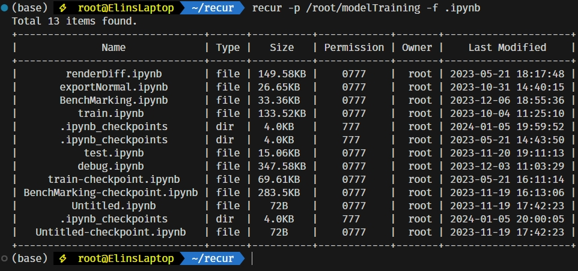

# Recur：a more smooth way *ls*

Recur is a more smooth way of `ls` written in Python,it is easy to manage files on your current Linux based system.

As you see on the above screen shot,recur has the capability of:

- get file basic information like: name,types,size,permision,owner and stringtified modified time convert to your machine timezone since last modification.

- counter for target result that let you easily to know how many file or dir object in your specific.

- specific file type filtering.

### Usage

Recur currently has three valid parameter that you can given into:

| Shorcut | Full      | Expect                                                                                                                     | Returned                                                                                                                                |
|:-------:|:---------:|:--------------------------------------------------------------------------------------------------------------------------:|:---------------------------------------------------------------------------------------------------------------------------------------:|
| -v      | --version | None                                                                                                                       | A version string that already written,since this is my firstime to write a program that with earnestness,so this part would very short. |
| -p      | --path    | Valid path that stored on your machine fs                                                                                  | Print out a prettied table with recurse searching results.The result count would shown above the table as expected.                     |
| -h      | --help    | None                                                                                                                       | Return the help string from program.                                                                                                    |
| -f      | --filter  | A valid file type that your given,make sure `.` inside your given,otherwise recur won't recognize it as a valid file type. | Recurse result with filtered that transfer to table render method.                                                                      |

### Enviroment&Build

#### Conda

If you're a conda user,make sure that you need to change `prefix` in `env.yml` file,because this prefix will assert that you conda binaries already installed in /root.

The expect working prefix is that : `{$CONDA_HOME}/envs`

#### Pure Python

If you're the pure Python user,make sure you create a virtual env and then run `pip install -r requirements.py`

### Load as a individual program

Once that you build or download the Recur binaries,you can modify your `.bashrc` file or `/etc/profile`,add your stored path as `$PATH`,and use `source /home/{$USER_NAME}/.bashrc` or `source /etc/profile` to make it work.

### Final

Hope you have fun with recur,take care.
